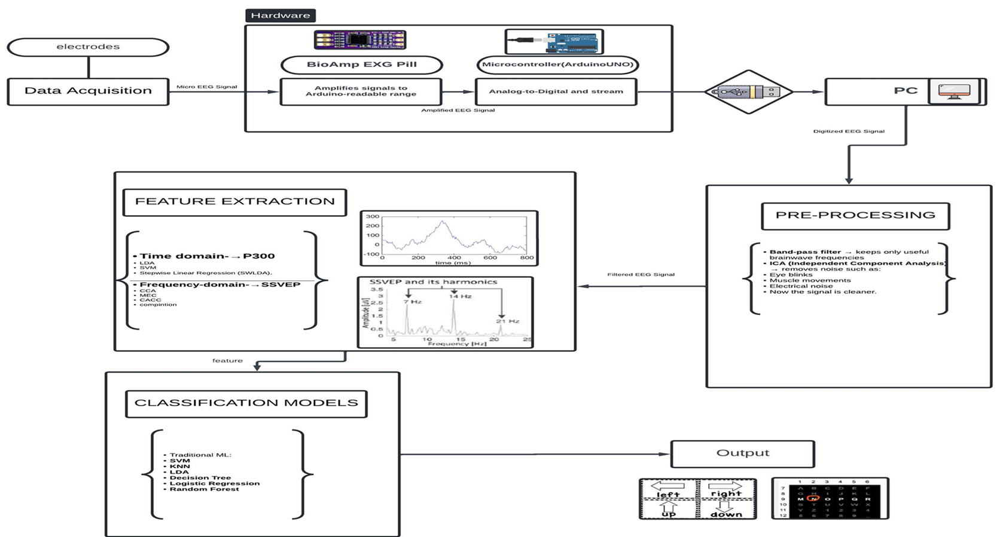

## 🧠 Low-Cost EEG-Based Brain Computer Interface (SSVEP)

This project implements a **low-cost EEG-based Brain-Computer Interface (BCI)** using **Steady-State Visually Evoked Potentials (SSVEP)**.

It captures **real-time EEG signals from a microcontroller**, processes them using **signal processing (FFT / PSD)**, and detects the frequency the user is focusing on to generate commands.

---

## 🎯 Overview

The system works by:

- Displaying **flickering visual stimuli** at different frequencies  
- The user focuses on one stimulus  
- The brain generates EEG activity at the same frequency  
- The system detects this frequency and maps it to a **selection or command**

---

## ⚠️ Current Status

**The SSVEP BCI is experimental and not fully reliable**

- Sensitive to noise  
- Requires good electrode placement  
- Performance depends on user focus and signal quality  

---

## 🧩 System Architecture



---

## 📁 Project Structure

```bash
.
├── eegInterface.py
├── eegScope.py
├── run_bci.py
├── ssvep_pipeline.py
├── ssvep_serial_acquisition.py
│
└── Nucleo Code/
    └── EEG_uC_code/
```

---

## ⚙️ System Overview

### 1. Data Acquisition
- EEG electrodes (Oz, REF, GND)  
- Amplification (BioAmp EXG)  
- ADC sampling  
- Serial streaming  

### 2. Processing Pipeline
- Bandpass filtering (8–15 Hz)  
- Notch filtering (50 Hz)  
- FFT / PSD  
- Peak detection  

### 3. Output
- Visualization  
- Frequency classification  

---

## 🧰 Requirements

### Hardware
- STM32 / Arduino  
- EEG amplifier  
- Electrodes  
- USB  

### Software

```bash
pip install numpy scipy matplotlib pyserial pandas
```

---

## 🚀 Getting Started

### 1. Flash Microcontroller
- Open: `Nucleo Code/EEG_uC_code/`
- Build with STM32CubeIDE
- Flash firmware

### 2. Connect Hardware
- IN+ → Oz  
- REF → right ear  
- GND → left ear  

### 3. Run

```bash
python run_bci.py
```

### 4. Visualize

```bash
python eegScope.py
```

---

## ⚠️ Disclaimer

Not a medical device. Use at your own risk.
